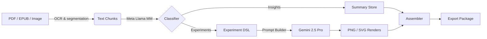

# [Surely You’re Joking, Mr. **Llama**](https://en.wikipedia.org/wiki/Surely_You%27re_Joking,_Mr._Feynman!)

*A multimodal physics‑textbook summarizer & experiment visualizer inspired by Richard Feynman’s legendary [Caltech lectures](https://www.feynmanlectures.caltech.edu/).*


---

## Table of Contents

1. [Introduction](#introduction)
2. [Features](#features)
3. [System Architecture](#system-architecture)
4. [Quick Start](#quick-start)
5. [Installation](#installation)
6. [Usage](#usage)
7. [Examples](#examples)
8. [Configuration](#configuration)
9. [Roadmap](#roadmap)
10. [Contributing](#contributing)
11. [Citation](#citation)
12. [License](#license)

---

## Introduction

Physics is best learned through clear explanations *and* vivid demonstrations. **Surely You’re Joking, Mr. Llama (SYJML)** automates both:

1. **Summarize.** It extracts chapter‑level **key insights**, formulas, and historical context from any physics textbook (PDF, EPUB, or OCR images).
2. **Explain Experiments.** It isolates every described experiment—from Millikan’s oil‑drop to J.J. Thomson’s cathode ray—and rewrites them into concise, step‑by‑step protocols.
3. **Visualize.** Each protocol is piped to **Gemini 2.5 Pro** to generate accurate, high‑resolution schematic images suitable for lecture slides or lab manuals.

The result: a Feynman‑style digest of theory *and* hands‑on intuition in minutes.

---

## Features

* **Meta Llama MM** backbone for multimodal text+diagram understanding.
* **Chunk‑aware summarization** that respects textbook structure, preserving sections, subsections, and equation numbering.
* **Experiment extractor** powered by a fine‑tuned span‑classification head.
* **Gemini 2.5 Pro image pipeline** with automatic prompt engineering (temperature, negative prompts, safety filters).
* **Export** to Markdown, LaTeX, and interactive HTML (Reveal.js slides).
* **CLI & Python SDK** plus optional Streamlit web UI.
* **Extensible**: plug‑in support for GPT‑4o checks, custom vision models, or bespoke citation styles.

---

## System Architecture



---

## Quick Start

```bash
# 1  Clone & create env
git clone https://github.com/kenneally15/Surely-You-re-Joking-Mr-Llama.git
cd Surely-You-re-Joking-Mr-Llama
python -m venv .venv && source .venv/bin/activate

# 2  Install core deps
pip install -r requirements.txt

# 3  Download models (≈ 12 GB)
python tools/download_models.py --llama-mm --gemini-pro

# 4  Run demo summary
python syjml/run.py --input docs/feynman_vol1.pdf --out out/demo
```

The default config will output:

* `summary.md` – textbook digest
* `experiments/` – folder of PNG schematics & captions
* `slides.html` – interactive deck

---

## Installation

SYJML targets **Python ≥ 3.10** and **CUDA 12**. Detailed steps for Linux & macOS are in [INSTALL.md](INSTALL.md). A Dockerfile is provided for one‑command setup.

---

## Usage

### CLI

```bash
python syjml/run.py \
  --input path/to/textbook.pdf \
  --chapters 1-7 9 \
  --vision-resolution 2048 \
  --export md pdf
```

### Python API

```python
from syjml import Pipeline
pipe = Pipeline.from_pretrained()
results = pipe("/data/griffiths_optics.pdf", chapters=["2", "3"])
print(results.summary[0].text)
results.experiments[0].image.show()
```

### Streamlit UI

```bash
streamlit run syjml/app.py
```

---

## Configuration

* \`\` controls chunk size, overlap, Gemini prompt templates, image specs, and safety settings.
* **Environment variables** (`OPENAI_API_KEY`, `GEMINI_API_KEY`, etc.) manage credential storage.
* **Adapters.** Replace Gemini with Stable Diffusion XL by pointing `vision_backend: "sdxl"`.

---

## Roadmap

| Phase | Goal                                               | ETA     |      |
| ----- | -------------------------------------------------- | ------- | ---- |
| 1     | End‑to‑end MVP (current)                           | ✅ Now   |      |
| 2     | Interactive Jupyter plugin for inline explanations | Q3 2025 |      |
| 3     | Cross‑textbook knowledge graph for concept linking | Q4 2025 |      |
| 4     | Voice‑over narrated videos (TTS)                   |         | 2026 |

---

## Contributing

Pull requests are welcome! Please run `pre‑commit` and ensure new unit tests pass (`pytest -q`). For major changes, open a discussion first.

---

## Citation

If you use SYJML in academic work, please cite:

```bibtex
@software{kenneally2025syjml,
  author       = {Kenneally, Kevin},
  title        = {Surely You’re Joking, Mr. Llama: Multimodal Physics Textbook Summarization},
  year         = {2025},
  url          = {https://github.com/kenneally15/Surely-You-re-Joking-Mr-Llama},
  version      = {1.0.0}
}
```

---

## License

This project is licensed under the **MIT License**. See [LICENSE](LICENSE) for details.

*“If you can’t explain something to a first‑year student, then you haven’t really understood.”* — Richard Feynman


# Surely You're Joking Mr. Llama

A physics textbook summarization application inspired by the Feynman Lectures at Caltech.

## Prerequisites

1. Node.js (v14 or higher)
2. A Meta Llama API key

## Setup

1. Install dependencies:
```bash
npm install
```

2. Create a `.env` file in the root directory and add your API key:
```
REACT_APP_LLAMA_API_KEY=your_api_key_here
```

3. Start the development server:
```bash
npm start
```

The application will be available at http://localhost:3000

## Features

- Real-time interaction with the Meta Llama API
- Message history with user and assistant messages
- Loading states and error handling
- Modern UI with Tailwind CSS

## Usage

1. Type your message in the text area
2. Click the "Send" button or press Enter to submit
3. Wait for the API response
4. View the response in the chat history

## Note

Make sure to keep your API key secure and never commit it to version control. The `.env` file is automatically ignored by git. 
